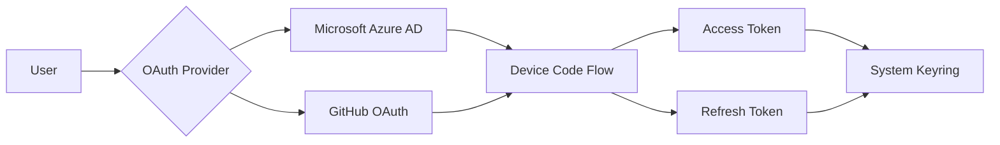

# Cursor 3.7.27 逆向分析 — 综合架构总结

## 版本快照

| 项目 | 值 |
|------|------|
| **版本号** | 3.7.27 |
| **构建 Hash** | e48ee6102a199492b0c9964699bf011886708ba3 |
| **构建日期** | 2026-06-10 |
| **VSCode 基底** | 1.105.1 |
| **许可** | MIT (Anysphere, Inc.) |
| **内部 CI 名称** | everysphere |

---

## 架构总览

```mermaid
graph TB
    subgraph "User Interface (Electron)"
        MAIN[main.js - 主进程<br/>1.6MB]
        WORKBENCH[workbench.desktop.main.js<br/>59MB]
        GLASS[Glass UI<br/>品牌资源]
    end
    
    subgraph "Cursor AI Extensions"
        AGENT_EXEC[cursor-agent-exec<br/>68MB - Agent引擎]
        MCP[cursor-mcp<br/>2.9MB - MCP协议]
        RETRIEVAL[cursor-retrieval<br/>31MB - 代码检索]
        COMMITS[cursor-commits<br/>2.5MB - Git集成]
        RESOLVER[cursor-resolver-helper<br/>2.8MB - 解析器]
        BROWSER_AUTO[cursor-browser-automation<br/>1.6MB - 浏览器自动化]
        ALWAYS_LOCAL[cursor-always-local<br/>3.9MB]
        SHADOW_WS[cursor-shadow-workspace<br/>1.2MB]
        OTHERS[其他10个小扩展]
    end
    
    subgraph "Communication"
        TUNNEL[cursor-tunnel - Rust<br/>19MB - SSH/WSS隧道]
        CODETUNNEL[code-tunnel - Rust<br/>19MB]
    end
    
    subgraph "Infrastructure"
        CVM[cursorvm-manager.com<br/>多区域推理集群]
        API2[api2.cursor.sh<br/>主API/更新/分析]
        API3[api3.cursor.sh<br/>Statsig遥测代理]
        MARKET[cursorapi.com<br/>扩展市场]
        BLOB[cursor.blob.core.windows.net<br/>远程服务器下载]
    end
    
    subgraph "LLM Providers"
        ANTHROPIC[api.anthropic.com/v1]
        OPENAI[api.openai.com/v1]
        BEDROCK[bedrock-runtime.aws.com]
        CURSOR_VM[cursorvm-manager.com<br/>自有推理]
    end
    
    subgraph "Telemetry & Monitoring"
        STATSIG[Statsig - 功能开关]
        SENTRY[Sentry - 错误追踪]
        OTEL[OpenTelemetry - 15+ 包]
    end

    MAIN --> AGENT_EXEC
    MAIN --> MCP
    AGENT_EXEC --> ANTHROPIC
    AGENT_EXEC --> OPENAI
    AGENT_EXEC --> BEDROCK
    AGENT_EXEC --> CURSOR_VM
    AGENT_EXEC --> RETRIEVAL
    AGENT_EXEC --> BROWSER_AUTO
    MCP --> CURSOR_VM
    MAIN --> TUNNEL
    TUNNEL --> API2
    WORKBENCH --> STATSIG
    MAIN --> SENTRY
    MAIN --> OTEL
    RESOLVER --> API2
    RETRIEVAL --> CURSOR_VM
```



---

## 18 个 Cursor 特有扩展

| 扩展名 | 大小 | 功能类别 | 重要性 |
|--------|------|---------|:------:|
| **cursor-agent-exec** | 68MB | Agent 执行引擎 | ⭐⭐⭐ |
| **cursor-retrieval** | 31MB | 代码智能检索 | ⭐⭐⭐ |
| **cursor-agent-worker** | 2.0MB | Agent Worker | ⭐⭐ |
| **cursor-always-local** | 3.9MB | 本地优先 | ⭐⭐ |
| **cursor-browser-automation** | 1.6MB | 浏览器自动化 | ⭐⭐⭐ |
| **cursor-commits** | 2.5MB | Git 提交管理 | ⭐⭐ |
| **cursor-mcp** | 2.9MB | MCP 协议 | ⭐⭐⭐ |
| **cursor-resolver-helper** | 2.8MB | 解析器辅助 | ⭐⭐ |
| **cursor-shadow-workspace** | 1.2MB | 影子工作区 | ⭐⭐ |
| **cursor-deeplink** | 900KB | 深度链接 | ⭐ |
| **cursor-checkout** | 28KB | 代码检出 | ⭐ |
| **cursor-explorer** | 28KB | 文件浏览 | ⭐ |
| **cursor-file-service** | 16KB | 文件服务 | ⭐ |
| **cursor-ndjson-ingest** | 32KB | NDJSON 导入 | ⭐ |
| **cursor-polyfills-remote** | 112KB | 远程 Polyfill | ⭐ |
| **cursor-resolver** | 64KB | 解析器 | ⭐ |
| **cursor-socket** | 28KB | Socket 通信 | ⭐ |
| **cursor-worktree-textmate** | 128KB | TextMate 语法 | ⭐ |

## 基础设施地图

### API 服务 (api2.cursor.sh)
```
https://api2.cursor.sh/updates                    — 更新服务
https://api2.cursor.sh/extensions-control          — 扩展控制
https://api2.cursor.sh/aiserver.v1.AnalyticsService/UploadIssueTrace
                                                  — 分析/遥测
```

### 推理基础设施 (cursorvm-manager.com)
```
区域分布:
  生产 (6+ 区域): us1, us3, us4, us5, us6, us7
  冗余 (6+ 区域): us1p, us3p, us4p, us5p, us6p, us7p
  训练集群 (9): train1 ~ train9
  评估集群 (3): eval1 ~ eval3
  测试集群 (2): test1, test2-gcp
  开发集群 (1): dev
```

### 遥测代理 (api3.cursor.sh)
```
路径: /tev1/v1
用途: Statsig 事件代理
```

### 基础设施提供商
| 服务 | 提供商 |
|------|--------|
|cursorvm-manager.com | **自有**推理集群 |
|api2.cursor.sh | **自有**API服务 |
|api3.cursor.sh | **自有**遥测代理 |
|cursorapi.com | **自有**备用域名 |
|cursor.blob.core.windows.net | Azure Blob |
|cursor-cdn.com | CDN |
|Vercel Blob Storage | MCP 品牌资源 |

## 认证流程

### 隧道认证 (cursor-tunnel 二进制)


OAuth 客户端：
- **Microsoft**: `aebc6443-996d-45c2-90f0-388ff96faa56`
- **GitHub**: `01ab8ac9400c4e429b23`

### 扩展认证
```json
"cursorTrustedExtensionAuthAccess": [
    "anysphere.cursor-retrieval",
    "anysphere.cursor-commits"
]
```

## AI Agent 系统

### Agent Store (虚拟文件系统)
Agent 的工具和知识以**可挂载的文件系统**形式组织：
```
Agent Store 命令:
- mount / detach mount / list mounts — 挂载管理
- force sync / rebootstrap — 同步管理
- reveal directory — 目录查看
```

### Agent 执行能力
1. **LLM 调用**: Claude, GPT, AWS Bedrock, Cursor 自有
2. **终端执行**: cursorPseudoterminal API
3. **文件操作**: cursorDiskKV 存储系统 + 文件系统
4. **网络请求**: HTTP 客户端
5. **浏览器自动化**: Chrome DevTools Protocol
6. **MCP 工具**: 第三方 MCP 服务器

### MCP 生态系统
信任的第三方 MCP：
- Notion, Sentry, Atlassian, Intercom, Asana, Linear
- Figma, Prisma, Square, Playwright, Context7
- MCP OAuth 回调: `cursor.com/agents/mcp/oauth/callback`

## 遥测与监控体系

```
┌─────────────────────────────────────────────┐
│ Cursor 3.7 遥测架构                           │
├─────────────────────────────────────────────┤
│ Statsig (功能开关 + A/B测试)                  │
│   → api3.cursor.sh/tev1/v1                  │
├─────────────────────────────────────────────┤
│ Sentry (错误追踪)                             │
│   @sentry/browser + @sentry/node +           │
│   @sentry/electron                           │
├─────────────────────────────────────────────┤
│ OpenTelemetry (分布式追踪, 15+ 包)            │
│   HTTP, Express, GraphQL, MongoDB, MySQL,    │
│   Redis, Kafka, PostgreSQL, 文件系统...       │
├─────────────────────────────────────────────┤
│ 自有分析服务                                  │
│   api2.cursor.sh/aiserver.v1.AnalyticsService │
└─────────────────────────────────────────────┘
```

## 关键发现

### 1. **Cursor 拥有完整的 AI 基础设施**
- 多区域推理集群 (cursorvm-manager.com)
- 自有 API 服务 (api2/3.cursor.sh)
- 从训练到生产的全链路自建

### 2. **MCP 是核心协议**
- 使用 Anthropic MCP SDK v1.25.1（有自定义补丁）
- 集成 10+ 第三方 MCP 服务器
- Agent 通过 MCP 与外部工具交互

### 3. **多模型提供商支持**
- Anthropic Claude (api.anthropic.com/v1)
- OpenAI GPT (api.openai.com/v1)
- AWS Bedrock (多种模型)
- Cursor 自有推理

### 4. **GitHub Copilot 被替代**
- `cannotImportExtensions` 阻止了 GitHub Copilot 的导入
- Cursor 内置了类似的 AI 功能
- 但 `defaultChatAgent` 仍配置为 Copilot

### 5. **从编辑器 → Agent 平台转型**
- cursor-agent-exec (68MB) 是最大的扩展
- 支持浏览器自动化、终端执行、文件操作
- Agent Store 作为虚拟文件系统
- 42 个内部功能开关

### 6. **遥测非常完善**
- Statsig (功能开关/实验)
- Sentry (错误追踪)
- OpenTelemetry (分布式追踪, 15+ 包)
- 自有分析上传服务

### 7. **通信安全采用多协议**
- SSH (russh) + WebSocket (tokio-tungstenite)
- OAuth 2.0 双提供商 (Microsoft + GitHub)
- 系统密钥环存储令牌

### 8. **基础设施域名家族**
```
cursor.sh           — 主域名
cursor.com          — 产品域名
cursorapi.com       — API备用
cursorvm-manager.com — 推理集群
cursor-cdn.com      — CDN
cursor.so           — 早期域名
cursor.blob.core.windows.net — 远程文件下载
```

## 目录索引

| 子目录 | 文档 | 覆盖范围 |
|--------|------|---------|
| 01-configuration | product-json-analysis.md | 产品配置分析 |
| 02-main-process | main-js-analysis.md | 主进程分析 |
| 03-agent-system | cursor-agent-exec-analysis.md | Agent 系统 |
| 04-mcp-protocol | cursor-mcp-analysis.md | MCP 协议 |
| 05-retrieval | (待完成) | 代码检索 |
| 06-communication | cursor-tunnel-analysis.md | 通信隧道 |
| 07-authentication | (待完成) | 认证机制 |
| 08-extensions | (待完成) | 扩展概览 |
| 09-node-modules | node-modules-analysis.md | 依赖分析 |
| 10-glass-ui | (待完成) | Glass UI |
| 11-summary | (本文件) | 综合总结 |