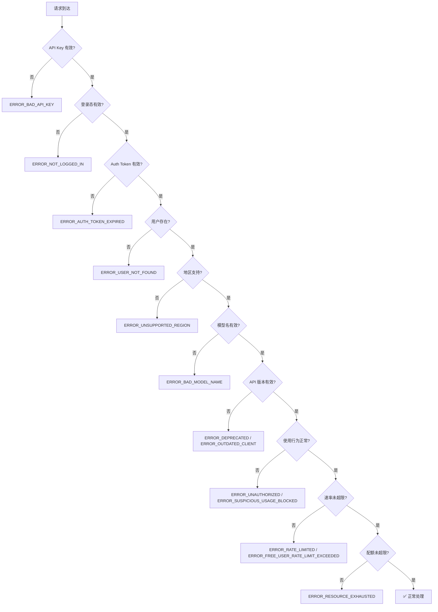

# Cursor 风控体系 — 完整错误码与风控触发条件 (第10轮)

## 一、完整错误码体系 (56个)

### 1.1 认证类 (8个)

| 错误码 | 触发条件 |
|--------|---------|
| `ERROR_BAD_API_KEY` | API Key 格式/内容错误 |
| `ERROR_BAD_USER_API_KEY` | 用户提供的 API Key 无效 |
| `ERROR_NOT_LOGGED_IN` | 未登录状态 |
| `ERROR_INVALID_AUTH_ID` | Auth ID 无效 |
| `ERROR_NOT_HIGH_ENOUGH_PERMISSIONS` | 权限不足 |
| `ERROR_AGENT_REQUIRES_LOGIN` | Agent 需要登录 |
| `ERROR_AUTH_TOKEN_NOT_FOUND` | 未找到认证令牌 |
| `ERROR_AUTH_TOKEN_EXPIRED` | 令牌过期 |

### 1.2 账户/订阅类 (7个)

| 错误码 | 触发条件 |
|--------|---------|
| `ERROR_USER_NOT_FOUND` | 用户不存在 |
| `ERROR_FREE_USER_RATE_LIMIT_EXCEEDED` | 免费用户速率超限 |
| `ERROR_PRO_USER_RATE_LIMIT_EXCEEDED` | Pro 用户速率超限 |
| `ERROR_FREE_USER_USAGE_LIMIT` | 免费用户用量超限 |
| `ERROR_PRO_USER_USAGE_LIMIT` | Pro 用户用量超限 |
| `ERROR_PRO_USER_ONLY` | 仅 Pro 用户可用 |
| `ERROR_USAGE_PRICING_REQUIRED` | 需要付费使用 |
| `ERROR_USAGE_PRICING_REQUIRED_CHANGEABLE` | 需要付费（可切换） |

### 1.3 风控/安全类 (10个)

| 错误码 | 触发条件 | 严重程度 |
|--------|---------|:--------:|
| `ERROR_UNAUTHORIZED` | 请求被风控拦截 | 🔴 最高 |
| `ERROR_RATE_LIMITED` | 速率受限 | 🟡 |
| `ERROR_RATE_LIMITED_CHANGEABLE` | 速率受限（可变更） | 🟡 |
| `ERROR_SUSPICIOUS_USAGE_BLOCKED` | 可疑使用行为 | 🔴 最高 |
| `ERROR_GENERIC_RATE_LIMIT_EXCEEDED` | 通用速率限制 | 🟡 |
| `ERROR_API_KEY_RATE_LIMIT` | API Key 速率限制 | 🟡 |
| `ERROR_HOOKS_BLOCKED` | Hook 被阻止 | 🟡 |
| `ERROR_MODEL_BLOCKED` | 模型被阻止 | 🟡 |
| `ERROR_UNSUPPORTED_REGION` | 不支持的地区 | 🔴 |
| `ERROR_SLOW_POOL` | 慢速池（降级）| 🟢 |

### 1.4 模型/请求类 (13个)

| 错误码 | 触发条件 |
|--------|---------|
| `ERROR_BAD_MODEL_NAME` | 模型名无效 |
| `ERROR_MODEL_NO_LONGER_SUPPORTED` | 模型不再支持 |
| `ERROR_MAX_TOKENS` | Token 超限 |
| `ERROR_CONVERSATION_TOO_LONG` | 对话过长 |
| `ERROR_OPENAI` | OpenAI 错误 |
| `ERROR_OPENAI_RATE_LIMIT_EXCEEDED` | OpenAI 限流 |
| `ERROR_PROVIDER_ERROR` | Provider 错误 |
| `ERROR_CLAUDE_IMAGE_TOO_LARGE` | 图片过大 |
| `ERROR_NETWORK_ERROR` | 网络错误 |
| `ERROR_TIMEOUT` | 超时 |
| `ERROR_EXTENSION_HOST_TIMEOUT` | 扩展主机超时 |
| `ERROR_DEBOUNCED` | 去重丢弃 |
| `ERROR_MAX_MODE_REQUIRED` | 需要 Max 模式 |

### 1.5 功能限制类 (8个)

| 错误码 | 触发条件 |
|--------|---------|
| `ERROR_RESOURCE_EXHAUSTED` | 资源耗尽 |
| `ERROR_DEPRECATED` | 接口已废弃 |
| `ERROR_OUTDATED_CLIENT` | 客户端版本过旧 |
| `ERROR_BAD_REQUEST` | 请求格式错误 |
| `ERROR_NOT_FOUND` | 资源/路由不存在 |
| `ERROR_FILE_NOT_FOUND` | 文件不存在 |
| `ERROR_CUSTOM_MESSAGE` | 自定义错误信息 |
| `ERROR_INTERNAL` | 服务器内部错误 |

### 1.6 GitHub 集成类 (4个)

| 错误码 | 触发条件 |
|--------|---------|
| `ERROR_GITHUB_NO_USER_CREDENTIALS` | 无 GitHub 凭证 |
| `ERROR_GITHUB_USER_NO_ACCESS` | GitHub 用户无权限 |
| `ERROR_GITHUB_APP_NO_ACCESS` | GitHub App 无权限 |
| `ERROR_GITHUB_MULTIPLE_OWNERS` | 多个仓库所有者 |

### 1.7 GPT/其他 (6个)

| 错误码 | 触发条件 |
|--------|---------|
| `ERROR_GPT_` | GPT 专有错误 |
| `ERROR_USER_ABORTED_REQUEST` | 用户取消请求 |
| `ERROR_PRICING_WARNING` | 定价警告 |
| `ERROR_CUSTOM` | 自定义错误 |
| `ERROR_REPOSITORY_SERVICE_REPOSITORY_IS_NOT_INITIALIZED` | 仓库未初始化 |

## 二、风控触发条件与响应码对应



## 三、风控严重等级

| 等级 | 错误码 | 恢复难度 |
|:----:|--------|:--------:|
| 🔴 硬拦截 | ERROR_UNAUTHORIZED, ERROR_SUSPICIOUS_USAGE_BLOCKED | 需重新登录/联系支持 |
| 🟡 限流 | ERROR_RATE_LIMITED, ERROR_xxx_RATE_LIMIT_EXCEEDED | 等待重置 |
| 🟢 可恢复 | ERROR_BAD_MODEL_NAME, ERROR_NOT_FOUND | 修正参数即可 |

## 四、第10轮新增发现汇总

| 发现 | 重要度 |
|------|:------:|
| **56个完整错误码** | ⭐⭐⭐ 风控体系核心 |
| **10个风控/安全错误码** | ⭐⭐⭐ 安全拦截体系 |
| **l4r() = UUID格式校验函数** | ⭐ 验证 machineId 为合法 UUID |
| **ErrorDetails 消息定义** | ⭐⭐ 错误响应结构 |

```
message ErrorDetails {
  Error error = 1;          // 错误码枚举
  string title = 2;         // 错误标题
  string detail = 3;        // 错误详情
  bool isRetryable = 4;     // 是否可重试
  bool showRequestId = 5;
  AnalyticsMetadata analyticsMetadata = 6;
}
```

*第10轮分析，2026-06-16*
*覆盖: 56个完整错误码、风控链路、严重等级*
