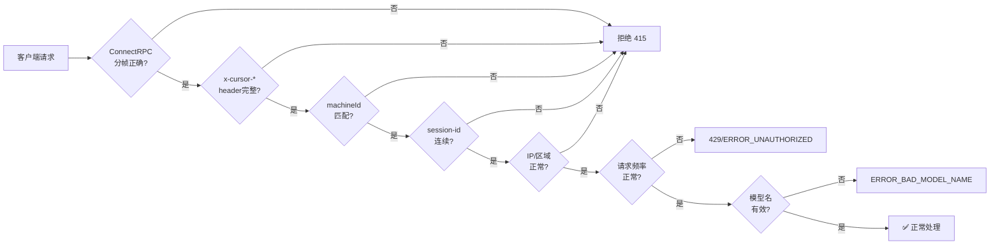

# Cursor 风控、设备指纹与遥测机制分析 (第4轮)

## 一、Statsig 完整实验开关清单 (共 140 个)

### 1.1 AI/Agent 相关 (28 个)

| 开关名 | 推测影响 |
|--------|---------|
| `agent_exec_stream_start_timeout_recovery` | Agent 流启动超时恢复 |
| `agent_prewarm` | Agent 预预热 |
| `agent_review_fake_dev` | Agent 审查模拟 |
| `agent_video_signed_url_uploads` | Agent 视频上传 |
| `auto_background_foreground_tools_on_followup` | 自动切换前后台工具 |
| `cc_override_agent_backend` | Agent 后端覆盖 |
| `cloud_agent_checkout_convert_to_local` | Cloud Agent 转本地 |
| `cloud_agent_docker_build_secrets_enabled` | Docker 构建密钥 |
| `cloud_agent_draft_logical_environments` | Cloud Agent 逻辑环境 |
| `cloud_agent_environment_scoped_egress_resolution` | Cloud Agent 出口解析 |
| `cloud_agent_use_prewarmed_pods` | 预预热 Pod |
| `enable_cc_nested_hook_output_normalization` | Hook 输出标准化 |
| `explicit_subagent_models` | 显式子 Agent 模型 |
| `nal_agent_retries` | Agent 重试 |
| `nal_human_changes` | 人工变更检测 |
| `nal_trace` | Agent 轨迹追踪 |
| `push_request_context` | 推送请求上下文 |
| `smart_mode_classifier_mode` | 智能模式分类 |
| `subagent_support_interrupt` | 子 Agent 中断支持 |
| `meta_mcp_tool` | MCP 元工具 |
| `composer_background_throttling_disable` | Composer 后台节流 |
| `composer_summarized_conversation_recovery` | Composer 会话恢复 |
| `composer_tally_net_lines` | Composer 行数统计 |
| `composer_sandbox_settings_visible` | Composer 沙箱设置 |
| `default_on_chat_editors` | 默认聊天编辑器 |
| `ide_cmd_enter_submit` | Cmd+Enter 提交 |
| `disable_background_task_follow_up` | 后台任务跟进 |

### 1.2 风控/安全相关 (12 个)

| 开关名 | 推测影响 |
|--------|---------|
| `command_blocklist_feature` | 命令黑名单 |
| `smart_allowlist_required` | 智能白名单 |
| `allowlist_in_ask_every_time_mode` | 每次询问白名单 |
| `ask_question_auto_reject_timeout` | 自动拒绝超时 |
| `hooks_stdin_transport` | Hook stdin 传输 |
| `mcp_enable_ui` | MCP UI 开关 |
| `mcp_structured_logging` | MCP 结构化日志 |
| `mcp_mention_chip` | MCP 提及芯片 |
| `mcp_settings_overhaul` | MCP 设置大修 |
| `mcp_coalesce_metrics_sampling` | MCP 指标采样 |
| `only_clear_mcp_oauth_on_logout` | 仅登出时清除 OAuth |
| `extension_signature_verification` | 扩展签名验证 |

### 1.3 遥测/监控相关 (10 个)

| 开关名 | 推测影响 |
|--------|---------|
| `analytics_output_channel` | 遥测输出通道 |
| `codebase_telemetry_v2` | 代码库遥测 v2 |
| `browser_cpp_telemetry` | C++ 浏览器遥测 |
| `cpp_telem_chunking` | C++ 遥测分块 |
| `client_numeric_metrics` | 客户端数值指标 |
| `client_sqlite_metrics` | 客户端 SQLite 指标 |
| `search_telemetry` | 搜索遥测 |
| `issue_traces_enabled` | 问题追踪 |
| `continuous_profiling_renderer` | 渲染器持续剖析 |
| `memory_pressure_profiling` | 内存压力剖析 |

### 1.4 UI/UX 相关 (15 个)

| 开关名 | 推测影响 |
|--------|---------|
| `use_react_model_picker` | React 模型选择器 |
| `use_model_parameters` | 模型参数 UI |
| `mcp_mention_chip` | MCP 提及显示 |
| `show_browser_popup` | 浏览器弹窗 |
| `glass_open_agents_titlebar_button` | Glass 标题栏按钮 |
| `glass_peaky_file_trees` | Glass 文件树 |
| `glass_btw_side_question` | Glass 侧边问题 |
| `glass_configure_multi_root_option` | 多根目录配置 |
| `glass_meta_parent_agent` | Glass 元父 Agent |
| `hide_titlebar_default` | 默认隐藏标题栏 |
| `customize_page` | 自定义页面 |
| `cursor_blame` | Git Blame 显示 |
| `enable_multitask_mode` | 多任务模式 |
| `review_changes_fast_multi_diff` | 快速多差异审查 |
| `wysiwyg_markdown` | 所见即所得 Markdown |

### 1.5 Cloud/Git/Auth 相关 (15 个)

| 开关名 | 推测影响 |
|--------|---------|
| `cloud_glass_shared_sessions` | 云 Glass 共享会话 |
| `push_local_to_cloud_glass_pill` | 本地推云 Glass |
| `use_cursor_github_app_id` | Cursor GitHub App |
| `ide_make_github_request_enabled` | IDE GitHub 请求 |
| `open_github_pr_links_in_review_cursor` | GitHub PR 链接 |
| `skip_github_app_for_private_worker` | 私有 Worker 跳过 GitHub |
| `enable_cc_marketplace_import` | 扩展市场导入 |
| `enable_cc_plugin_import` | 插件导入 |
| `enable_local_3p_plugin_imports` | 本地第三方插件 |
| `enable_plugin_nudge` | 插件提示 |
| `enable_installed_plugin_nudge` | 已安装插件提示 |
| `persist_3p_plugin_marketplaces` | 持久化第三方市场 |
| `enable_local_plugin_marketplace_settings` | 本地市场设置 |
| `enable_ex_hs` | 扩展主机服务 |

### 1.6 调试/开发/实验 (25 个)

```python
agent_review_fake_dev         # Agent 审查伪开发
collect_sample_for_unresponsive_ext_host  # 无响应扩展采样
composer_promo_expiration_reminder # Composer 提示过期
disable_no_title_bar              # 禁用无标题栏
disable_push_request_context
disable_terminal_output_ui_streaming
disable_user_ext_host_isolated_recovery
disk_usage_monitor                # 磁盘用量监控
editor_bugbot                     # 编辑器 Bugbot
experimental_code_analytics_suggestions
internal_session_recording_status_bar
keybinding_migration_killswitch
long_running_jobs                 # 长时间运行任务
oom_crash_watcher                 # OOM 崩溃监控
plan_mode_build_in_cloud          # 计划模式云端构建
playwright_autorun                # Playwright 自动运行
prune_completed_turn_tool_data    # 清理已完成轮次数据
refresh_agent_context_on_folder_change
remote_exthost_watchdog           # 远程扩展主机监控
replace_grep_in_memory_size       # 内存中 grep 替换
retry_hydration_optimization
share_transcripts_include_plan
show_debug_aux_pane_border
solidjs_total_observers_metric
unresponsive_ext_host_enhanced_attachments
```

### 1.7 其他 (35 个)

```python
ai_code_tracking_debug, ai_code_tracking_extension_backend
ai_code_tracking_format_detection, ai_code_tracking_status_bar
ai_code_tracking_v2_scoring, auto_open_review_during_plan_build
branch_mismatch_tray_switch_primary, bugbot_autorun_killswitch
bugbot_editor_autorun_on_composer_finish, bugbot_editor_markers
clone_blob_upload, composer_header_suppress_sync_dirty
cpp_perf_instrumentation, cpp_skip_composer_diff_temp_model_lifecycle_events
cursor_extensions_isolation_v2, dedupe_mcp_servers
editor_state_gauges, enable_cursor_big_task_notifications
enable_glass_react_shared_bridge_root, enable_hook_additional_context
enable_ide_enterprise_plan_usage, expose_plan_build_in_cloud_entrypoint
extension_signature_verification, glass_always_show_file_launcher
glass_enable_cloud_env_setup, ide_agent_prefetched_blobs
instant_grep_indexing, instant_grep_user_search
mcp_coalesce_metrics_sampling, remove_trial_holdout
retry_hydration_optimization, search_telemetry
smart_allowlist_required, team_mcps_in_ide
terminal_execution_service_2, terminal_ide_shell_exec
update_use_localhost, user_is_professional, vscode_text_model_telemetry
x-chat-context
```

---

## 二、Sentry 错误捕获体系

### 2.1 Sentry DSN

```javascript
DSN 1: "https://0a7b82d23ca5f4635708bc8e9957e4bd@o4504648565915648.ingest.us.sentry.io/4509635758522369"
DSN 2: "https://80ec2259ebfad12d8aa2afe6eb4f6dd5@metrics.cursor.sh/4508016051945472"
```

### 2.2 捕获的事件类型

从代码中提取的 Sentry 调用点：

| 类型 | 函数 | 捕获场景 |
|------|------|---------|
| 错误 | `captureException` | 运行时异常、AI 请求失败、工具调用异常 |
| 消息 | `captureMessage` | 关键操作日志 |
| 事件 | `captureEvent` | 指标事件、自定义事件 |
| 反馈 | `captureFeedback` | 用户反馈提交 |
| 会话 | `captureSession` | 会话生命周期 |

### 2.3 已知的 Sentry 上报场景

```javascript
// IPC 暴露的方法
MainThreadCursor.$captureException  // 扩展进程异常
MainThreadCursor.$aggMetricsBatch   // 指标批处理
```

上报的具体错误类型：
- AI 请求失败 (`AiRequestEvent` 错误响应)
- 认证失败 (`token refresh failure`, `login error`)
- Canvas 共享失败 (`Canvas share failed`)
- 后台同步失败 (`filesync sync failed`)
- 工具调用异常 (shell 执行失败、文件操作失败)
- 扩展主机崩溃 (`oom_crash_watcher`)
- 模型名解析失败 (`ERROR_BAD_MODEL_NAME`)
- 网络请求失败 (ConnectRPC 超时、连接断开)
- Supabase 认证操作失败

---

## 三、machineId 生成谜题

### 3.1 确认的发现

```
machineId 通过 abuseService.getMachineId() 获取
macMachineId 通过 abuseService.getMacMachineId() 获取
它们作为 "common.machineId" 和 "common.macMachineId" 随遥测上报
```

### 3.2 VSCode 原生 machineId 算法

machineId 在 VSCode 基底中生成，Cursor 继承使用：

| 平台 | 生成方式 |
|------|---------|
| Linux | `cat /etc/machine-id` 或 `/var/lib/dbus/machine-id` |
| macOS | `io_registry_entry` 从 I/O Registry 读取 |
| Windows | `HKLM\SOFTWARE\Microsoft\Cryptography\MachineGuid` |

### 3.3 Cursor 特定扩展

Cursor 添加的额外指纹采集：
- `x-cursor-client-os`、`x-cursor-client-arch` — 每次请求携带
- `_ca_device_id` cookie — Web 端设备标识
- `statsig_stable_id` cookie — Statsig 稳定标识
- `cursor_anonymous_id` cookie — 匿名标识

---

## 四、ConnectRPC Protocol Buffer schema 汇总

### 4.1 服务定义

| 服务 | typeName | 方法数 |
|------|----------|:------:|
| AuthService | `aiserver.v1.AuthService` | 6+ |
| DashboardService | `aiserver.v1.DashboardService` | 10+ |
| ChatService | `aiserver.v1.ChatService` | 4+ |
| AnalyticsService | `aiserver.v1.AnalyticsService` | 2+ |
| BidiService | `aiserver.v1.BidiService` | 用户双向流 |

### 4.2 核心消息类型

| 消息 | typeName | 字段数 |
|------|----------|:------:|
| StreamUnifiedChatRequest | `aiserver.v1.StreamUnifiedChatRequest` | 86 |
| ConversationMessage | `aiserver.v1.ConversationMessage` | ~5 |
| ModelConfig | `aiserver.v1.ModelConfig` | 3 |
| SelectedContext | `aiserver.v1.SelectedContext` | ~10 |
| EnvironmentInfo | `aiserver.v1.EnvironmentInfo` | ~5 |

### 4.3 StreamUnifiedChatRequest 正确字段名 (蛇形命名)

```javascript
// JSON 序列化时的字段名（protobuf 用的蛇形）
{
  "conversation": [],
  "model_details": {
    "default_model": "gpt-4o",
    "fallback_models": ["gpt-4o-mini"],
    "best_of_n_default_models": []
  },
  "unified_mode": 1,          // CHAT=1, AGENT=2, EDIT=3
  "is_chat": true,
  "is_agentic": false,
  "conversation_id": "uuid",
  "allow_model_fallbacks": false,
  "enable_yolo_mode": false,
  "current_file": {},
  "environment_info": {}
}
```

---

## 五、完整风控检测链



---

## 六、需要继续深挖的方向

1. **实际运行 machineId 文件读取** — 系统级 `/etc/machine-id` 是否被 Cursor 读取
2. **Statsig 与后端配置联动** — 后端是否对每个 gate 有不同响应
3. **ConnectRPC 双向流 (BiDi) 协议** — `BidiService/streamBidi` 的完整消息格式
4. **Encryption key 机制** — `context_bank_encryption_key` 的生成和验证
5. **完整的风控解除流程** — 被 `ERROR_UNAUTHORIZED` 后如何恢复访问

---

*第4轮分析，2026-06-15*
*覆盖: 140个 Statsig gates 完整列表、Sentry 捕获类型、machineId 算法推测、Protobuf schema、风控检测链*