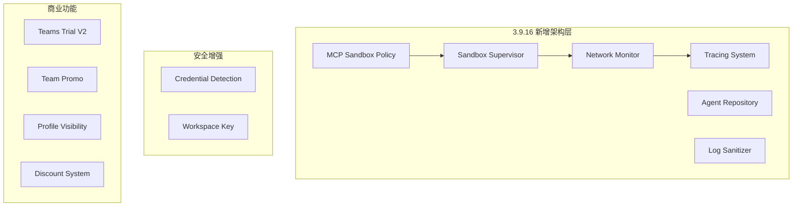

# Cursor 3.7.27 → 3.9.16 版本差异逆向分析报告

> **分析日期**: 2026-07-02
> **分析工具**: main.js 静态差异分析、配置文件对比
> **基线版本**: 3.7.27 (commit: `e48ee6102a`)
> **目标版本**: 3.9.16 (commit: `042b3c1a4`)

---

## 一、概述

Cursor 从 **3.7.27** 升级到 **3.9.16** 是一个跨大版本的跳跃（跳过了 3.8.x），共包含 **14 个新编译模块** 和 **约 60 个新的 packages 源文件**。主 JS 束从 **1,623,576 字节**(3.7) 增长到 **1,688,084 字节**(3.9)，增加约 **64KB**。

### 版本信息速览

| 项目 | 3.7.27 | 3.9.16 | 变化 |
|------|--------|--------|------|
| VS Code 基版 | 1.105.1 | 1.105.1 | 未变 |
| AppImage 大小 | ~285 MB | ~299 MB | +14 MB |
| 提取目录 | ~589 MB | ~652 MB | +63 MB |
| main.js | 1,623,576 B | 1,688,084 B | +64,508 B |
| cli.js | 209,290 B | 209,220 B | -70 B |
| bootstrap-fork.js | ~19 KB | ~19 KB | 仅 Debug ID 更新 |
| core API 端点 | 不变 | 不变 | 无新增 |
| Statsig Key | 不变 | 不变 | 无变更 |

---

## 二、核心变更分类

### 2.1 MCP(Sandbox) 安全策略体系 (新)

这是 **3.9 最大的新增功能**，引入了一套完整的 MCP 沙箱安全策略体系：

| 新模块 | 功能描述 |
|--------|----------|
| `mcp-sandbox-policy.ts` | MCP 沙箱策略核心定义 |
| `mcp-sandbox-policy-fingerprint.ts` | 沙箱策略的指纹/校验机制 |
| `mcp-sandbox-unavailable-error.ts` | 沙箱不可用时的错误类型 |
| `admin-mcp-policy.ts` | 管理员 MCP 策略 |
| `admin-mcp-tool-allowlist.ts` | MCP 工具白名单 |
| `mcp-config-service.ts` | MCP 配置服务 (已有模块升级) |
| `mcp-reconnect-config.ts` | MCP 重连配置 |

**影响**: Cursor 现在能够对 MCP Server 的工具执行施加更细粒度的安全策略控制，包括：
- 基于指纹的策略匹配
- 管理员可配置的工具白名单
- 沙箱不可用时的优雅降级

### 2.2 Sandbox 环境隔离 (全新子系统)

引入了一个完整的沙箱子系统：

| 新模块 | 功能 |
|--------|------|
| `sand-box.ts` | 沙箱容器定义 |
| `sand-box-archive.ts` | 沙箱归档管理 |
| `sand-box-store.ts` | 沙箱存储管理 |
| `sand-supervisor.ts` | 沙箱超级管理员进程 |
| `sandbox-helper` (二进制) | 沙箱辅助二进制 (`@anysphere/sandbox-helper`) |
| `cursorsandbox` (二进制) | Cursor 沙箱执行二进制 |

**关键路径**: `/tmp/sand-supervisor` — 沙箱监控 Supervisor
- `command.json` / `command.json.part` — 命令文件（写入原子性保障）
- `status.json` — 状态文件
- `acks` — ACK 队列
- `incoming-host-bundle.tgz` — 主机端代码包
- `/home/box/sand-host` — 沙箱内宿主环境
- `host-main.cjs` — 宿主入口
- 超时配置: 360 分钟 (6小时)

### 2.3 进程隔离与网络监控

| 新模块 | 功能 |
|--------|------|
| `nettopNetworkBandwidthSource.js` | macOS `nettop` 命令采集网络带宽 |
| `networkBandwidthSource.js` | 通用网络带宽源（空实现） |
| `mcpProcess.js` | MCP 子进程管理 |
| `mcpStdioSpawnEnvironment.js` | MCP stdio 生成环境配置 |

**MCP 进程管理新增 IPC 信号**:
- `vscode:electron-main->mcp-process=exit`
- `vscode:mcp-process->electron-main=ipc-ready`
- `vscode:mcp-process->electron-main=init-done`
- `vscode:mcp-process->electron-main=init-failed`
- 新增启动诊断信号: `startup-diagnostic`
- 新增详细的启动阶段跟踪: `entrypoint_loaded`, `config_wait_started`, `config_received`, `main_entered`, `before_ipc_ready`, `after_ipc_ready`, `init_services_start`, `init_services_end`, `init_channels_start`, `init_channels_end`, `before_init_done`, `after_init_done`, `init_failed`

**网络带宽监控**: 新增 `cursorProclist` (Cursor Process List) 服务
- 在 macOS 上通过 `/usr/bin/nettop` 采集 per-process 带宽使用
- 超时 12s，最大 buffer 8MB
- Linux 上为空实现 (返回空 Map)

### 2.4 遥测与链路追踪升级

| 新模块 | 功能 |
|--------|------|
| `spanLifecycle.js` | Span 生命周期管理 |
| `spanSampling.js` | Span 采样策略 |
| `traceparent.js` | W3C Trace Context (`traceparent` header) 支持 |
| `debuggingDataUploadValidation.js` | 调试数据上传验证 |

这标志着 Cursor 正在从简单的遥测事件上报转向**分布式链路追踪体系**，引入 W3C `traceparent` 标准兼容的追踪上下文传递。

### 2.5 Always-Local Singleton 模式

| 新模块 | 功能 |
|--------|------|
| `alwaysLocalSingleton.js` (common) | Always-Local 单例公共模块 |
| `alwaysLocalSingleton.js` (electron-main) | Electron 主进程实现 |
| `alwaysLocalSingletonObservability.js` | 可观测性增强 |

这个新系统确保某些服务在"始终本地"模式下也能以单例运行，可能用于增强离线/本地优先场景的稳定性。

### 2.6 更新诊断系统

| 新模块 | 功能 |
|--------|------|
| `updateDiagnostics.js` | 更新诊断核心 |
| `updateDiagnosticsLogSanitizer.js` | 更新日志清理（敏感信息脱敏） |
| `updateFileTail.js` | 更新日志 tail 追踪 |

**关键配置**: `cursor.updateDiagnostics.config`
- 默认禁用 (`enabled: false`)
- `restartTimeThresholdSeconds: 30`
- `attachShipItLog: true`
- `maxAttachmentBytes: 5MB`

**日志脱敏**: 敏感信息正则替换
- URL 凭证: `protocol://user:pass@` → `protocol://[REDACTED]@`
- 私钥: `-----BEGIN * PRIVATE KEY-----` → `[REDACTED:PRIVATE_KEY]`
- 缓冲区: 64KB

### 2.7 本地 Agent 仓库

| 新模块 | 功能 |
|--------|------|
| `localAgentRepository.js` | 本地 Agent 仓库管理 |
| `repoUtils.js` | 仓库工具函数 |

这表明 Cursor 正在构建本地 agent 模板/配置的仓库管理机制。

---

## 三、Packages 级别新增

### 3.1 `@packages/constants` 新增

| 文件 | 用途 |
|------|------|
| `canvas-host-theme.ts` | Canvas Host 主题 |
| `git.ts` | Git 常量 |
| `private-worker-bridge.ts` | 私有 Worker 桥接 |
| `sand-box.ts` | 沙箱定义 |
| `sand-box-archive.ts` | 沙箱归档 |
| `sand-box-store.ts` | 沙箱存储 |
| `sand-supervisor.ts` | 沙箱监督进程 |
| `side-chats.ts` | 侧边聊天常量 |
| `team-member-invite-promo.ts` | 团队成员邀请推广 (超时 10s) |

### 3.2 `@packages/utils` 新增

| 文件 | 用途 |
|------|------|
| `agent-turn-tracker.ts` | Agent 轮次跟踪 |
| `async-iterator.ts` | Async Iterator 工具 |
| `branch-prefix.ts` | 分支前缀 |
| `canvas-path.ts` | Canvas 路径工具 |
| `cloud-agent-models.ts` | **云端 Agent 模型定义** |
| `codex-citations.ts` | Codex 引用处理 |
| `environment-template.ts` | 环境模板渲染 |
| `file-url.ts` | file:// URL 处理 |
| `find-executable.ts` | 查找可执行文件 |
| `forkable-iterable.ts` | 可 fork 的 Iterable |
| `formal-keep-alive-agent.ts` | 正式的 Keep-Alive Agent (HTTP) |
| `git-ref.ts` | Git 引用处理 |
| `global-percent-off-discounts.ts` | 全局百分比折扣 |
| `host-machine-id.ts` | **宿主机 Machine ID 采集** |
| `model-utils.ts` | **模型工具函数** |
| `nal-trace-utils.ts` | NAL 追踪工具 |
| `observe-yield-latency.ts` | 产出延迟观察 |
| `path-matchers.ts` | 路径匹配器 |
| `profile-visibility.ts` | **Profile 可见性控制** |
| `promise-extras.ts` | Promise 扩展 |
| `replayable-async-iterable.ts` | 可重放的 Async Iterable |
| `repo-url.ts` | 仓库 URL 解析 |
| `result-formatting.ts` | 结果格式化 |
| `retry-state-machine.ts` | 重试状态机 |
| `security.ts` | **安全工具函数** |
| `spawn-promise.ts` | Spawn Promise 封装 |
| `stable-worker-id.ts` | 稳定 Worker ID |
| `terminal-allowlist.ts` | 终端白名单 |
| `ttl-cache.ts` | TTL 缓存 |
| `vendor/seedrandom.ts` | 确定性随机数 (seedrandom) |
| `web-search-year-guidance.ts` | Web 搜索年份指引 |
| `webp-codec.ts` | WebP 编解码 |
| `workspace-key.ts` | **Workspace 密钥派生** |
| `workspace-paths.ts` | Workspace 路径管理 |

---

## 四、安全与隐私关键变更

### 4.1 凭证检测增强

main.js 新增了更积极的凭证/密钥检测：

```
新增检测模式:
  - access_key / access-key / accesskey
  - private_key / private-key
  - AKIA* (AWS Access Key)
  - ASIA* (AWS Temporary Key)
  - ghp_ / gho_ / ghu_ / ghs_ / ghr_ / github_pat_ (GitHub Tokens)
  - xox* (Slack Tokens)
```

### 4.2 日志脱敏增强

在 `updateDiagnosticsLogSanitizer` 中实现：
- URL 中的凭证信息自动替换为 `[REDACTED]`
- PEM 私钥自动替换为 `[REDACTED:PRIVATE_KEY]`
- 64KB 缓冲区大小限制

### 4.3 Host Machine ID

新增 `host-machine-id.ts` 工具，可能用于设备指纹采集。

### 4.4 Workspace Key 派生

新增 `workspace-key.ts`，可能实现基于工作区的密钥派生机制。

---

## 五、团队与企业功能

### 5.1 新版 Team Trial

新增 `TEAMS_TRIAL_V2` 定价计划（与原有的 `TEAMS_TRIAL_V1` 并列）：

```javascript
d9 = "TEAMS_TRIAL_V1"
h9 = "TEAMS_TRIAL_V2"
KQ = {
  [d9]: "teams_trial",
  [h9]: "teams_trial_v2",
  [T2]: "startup_standard",
  [I2]: "startup_yc"
}
```

### 5.2 团队成员邀请推广

新增 `team-member-invite-promo.ts`，通知超时配置为 10 秒 (`CZ = 10000`)。

### 5.3 Profile 可见性控制

新增 `profile-visibility.ts`，支持用户 Profile 的可见性设置。

### 5.4 全局折扣系统

新增 `global-percent-off-discounts.ts`，支持全局百分比折扣的定价促销。

---

## 六、Glass UI 层变更

### 6.1 键盘快捷操作

新增键盘快捷键入口：
```
glass.newAgentFromKeyboard  ← 从键盘启动新 Agent
glass.newBrowser            ← 打开新浏览器
glass.newTab                ← 打开新标签页
glass.openEditorPanelNewTabMenu  ← 编辑面板新标签菜单
glass.nextTab / glass.previousTab  ← 标签导航
glass.goToTab1-4            ← 跳转到指定标签
```

### 6.2 Composer/Agent 使用量统计

| 引用 | 3.7.27 | 3.9.16 | 变化 |
|------|--------|--------|------|
| `composer` | 75 | 82 | +7 |
| `agent` | 124 | 131 | +7 |
| `Agent` | 82 | 90 | +8 |

---

## 七、实验与 A/B 测试体系

### 7.1 新增实验门控

从代码中检测到的新 feature flags 和实验：
- `TEAMS_TRIAL_V2` — 新版 Team Trial
- `cursor-for-startups` — Startup 计划
- `cursor-for-startups-yc` — YC Startup 计划
- `credit-grant-startup` — Startup 信用额度
- `credit-grant-yc-startup` — YC Startup 信用额度

### 7.2 定价参数

```
TEAMS_TRIAL_V2 额度: 500*100 = $50,000 credits (估计)
Startup 标准: 5,000*100 credits
Startup YC: 60,000*100 credits
月度: $12
Pro 月度: 5,000*100 credits
Pro 年度: 1,000*100 credits
```

---

## 八、基础设施与可观测性

### 8.1 W3C Trace Context 支持

新增 `traceparent.js` 支持 W3C 标准的分布式追踪上下文，使 Cursor 的遥测系统能与其他后端服务进行端到端追踪关联。

### 8.2 Span 生命周期与采样

- `spanLifecycle`: Span 创建、激活、结束生命周期管理
- `spanSampling`: 采样策略（决定哪些 span 被上报）

### 8.3 网络带宽监控

新增 `cursorProclist` 服务追踪各进程网络带宽使用（macOS 通过 `nettop`，Linux 暂为空）。

### 8.4 更新诊断

新增完整的更新失败诊断系统，可捕获更新日志、ShipIt 日志，并进行脱敏处理后上报。

### 8.5 启动诊断

MCP 进程启动阶段新增 12 个阶段的诊断信号，用于精确定位启动耗时瓶颈。

---

## 九、未变更的部分

以下核心配置在 3.7.27 → 3.9.16 中**未发生变化**：

- VS Code 基版本: `1.105.1`
- 所有 API 端点 (updateUrl, backupUpdateUrl, statsig, downloadUrl)
- Statsig Client Key 和上报端点
- AI Config (ariaKey)
- 远程服务器下载模板
- 扩展列表 (无新增或删除扩展)
- `@anysphere` 原生模块 (仅有 `policy-watcher`，无变化)

---

## 十、总结与影响评估

### 主要架构变化



### 关键发现

1. **沙箱化是最大变更** — Cursor 3.9 引入了完整的沙箱执行环境（sand-box 子系统 + sand-supervisor），使 AI agent 的执行与宿主环境隔离。这是配合 Cursor Agent 模式深度使用的安全基础设施。

2. **企业安全功能显著增强** — 新增强的凭证检测、日志脱敏、MCP 策略控制表明 Cursor 正在向企业级安全合规方向迈进。

3. **可观测性体系升级** — W3C Trace Context 支持和 Span 生命周期管理标志着一个更成熟的遥测基础设施。

4. **商业变现加速** — 新增 Teams Trial V2、discount 系统和 team member invite promos，表明商业化和团队销售是当前重点。

5. **网络带宽监控** — 新增的 `cursorProclist` 和 `nettopNetworkBandwidthSource` 意味着 Cursor 可能在追踪 agent 操作导致的网络资源消耗（proxy token 计量或异常检测）。

### 对现有 Proxy/逆向工程的影响

- **API 端点没有变化**，现有的 proxy 实现可以直接兼容
- **MCP 沙箱策略** 如果被启用，可能影响自定义 MCP Server 的连接方式
- **Sandbox Supervisor** 的引入可能使 Cursor 对子进程的监控更加严格
- **Trace context** 的引入新增了可追踪的 HTTP header，可被 proxy 用于请求追踪

---

*本报告由静态逆向分析生成，基于 Cursor 3.7.27 和 3.9.16 的 main.js bundle 差异对比。*